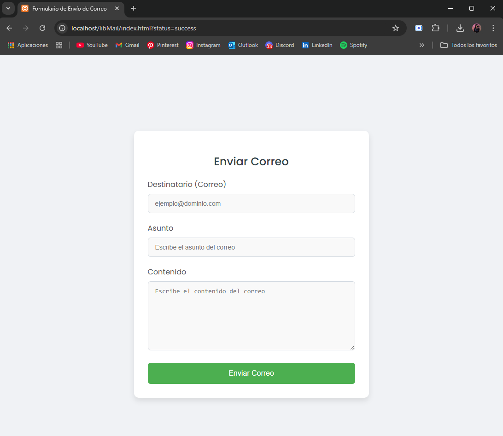
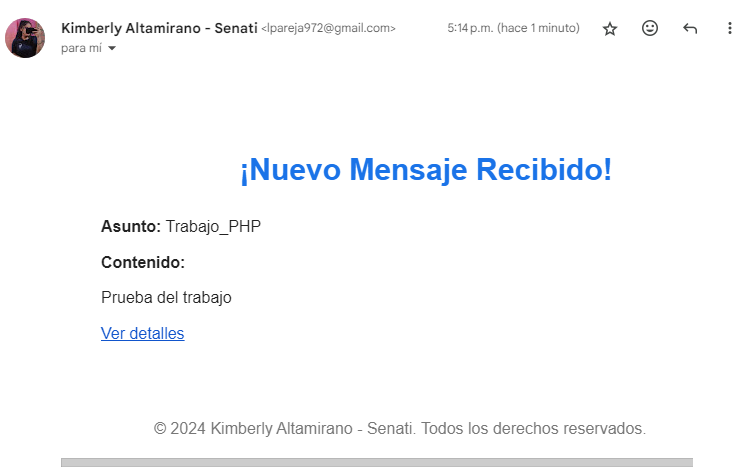
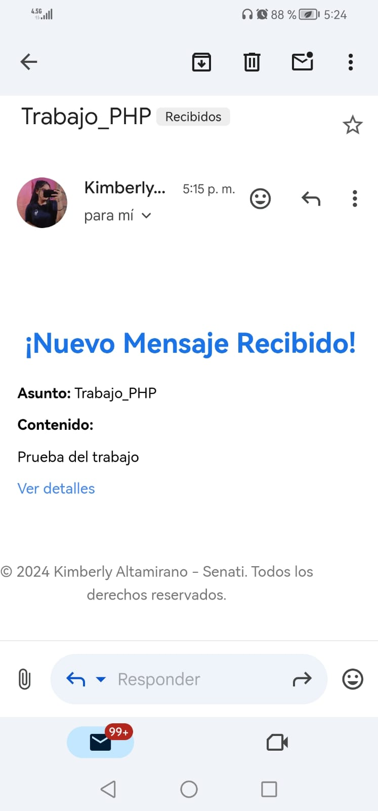

# PHP_MAILER - Sistema de Envío de Correos

Este proyecto permite enviar correos electrónicos con un formato HTML atractivo usando PHPMailer. El diseño es completamente responsivo gracias a Bootstrap, y permite enviar correos con un diseño profesional.

## Características

- **Envío de correos electrónicos** con asunto, destinatario y contenido.
- **Diseño HTML responsivo** para correos electrónicos atractivos.
- **Redirección** a un enlace al hacer clic en el botón "Ver detalles".

## Requisitos

- PHP 7.4 o superior
- Composer
- Cuenta de Gmail o servidor SMTP compatible

### Formulario en el navegador (PC)

### Correo recibido en PC

### Correo recibido en celular

